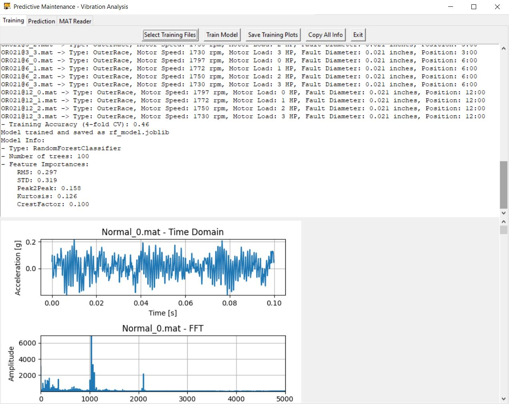
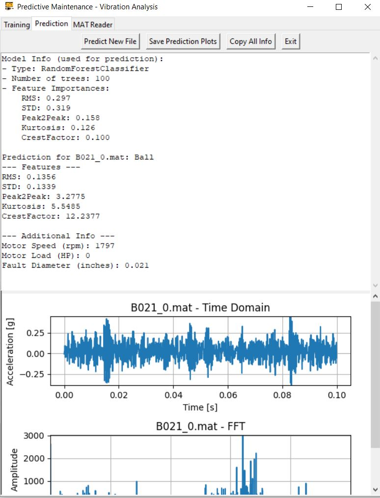

[](https://doi.org/10.5281/zenodo.18184132)

# Predictive Maintenance – Vibration Analysis Tool

A desktop application for **bearing fault analysis and predictive maintenance** using vibration signals.  
The software provides **signal visualization**, **feature extraction**, **machine learning–based classification**, and an **interactive GUI** for training, prediction, and `.mat` file inspection.

The project is designed for **engineering use, experimentation, and educational purposes**, using real vibration datasets commonly employed in condition monitoring research.

---

## ✨ Features

- 📊 **Time-domain and frequency-domain visualization**
  - Time signal plotting
  - FFT spectrum analysis
- 🧮 **Statistical feature extraction**
  - RMS
  - Standard Deviation
  - Peak-to-Peak
  - Kurtosis
  - Crest Factor
- 🤖 **Machine Learning classification**
  - Random Forest classifier
  - Multi-class fault identification:
    - Normal
    - Inner Race faults
    - Outer Race faults
    - Ball faults
- 🧠 **Model evaluation**
  - Cross-validation (when class balance allows)
  - Feature importance analysis
- 🖥️ **Graphical User Interface (GUI)**
  - Training tab
  - Prediction tab
  - `.MAT` file reader and explorer
- 💾 **Model persistence**
  - Save and load trained models (`joblib`)
- 🖼️ **Plot export**
  - Save training and prediction plots as images

---

## 📁 Supported Data

The software is designed to work with vibration signals stored in MATLAB `.mat` files, such as those from:

- **Case Western Reserve University (CWRU) Bearing Dataset**
- Other datasets containing **Drive End (DE)** vibration signals

Each file can be associated with metadata such as:
- Motor speed (RPM)
- Motor load (HP)
- Fault type
- Fault diameter
- Fault position (for outer race defects)

Metadata handling is configurable via an internal file information dictionary.

---

## 🧩 Application Structure

### 1. Training Tab
- Select multiple `.mat` files for training
- Automatic feature extraction
- Model training with Random Forest
- Feature importance visualization
- Training accuracy via cross-validation
- Time & FFT plots for each training signal

### 2. Prediction Tab
- Load a new `.mat` file
- Predict bearing condition
- Display extracted features
- Show model details and feature importance
- Time & FFT visualization of the test signal

### 3. MAT Reader Tab
- Inspect any `.mat` file
- View available variables
- Display statistics (min, max, mean, std)
- Automatically plot vibration signals if detected

---

## 🛠️ Installation

### Requirements

- Python **3.9+**
- Required libraries:
```bash
  pip install numpy scipy matplotlib scikit-learn joblib pillow
```

## ▶️ Usage

Run the application with:

```bash
python main.py
```

On startup:
- A splash screen is displayed
- The main GUI loads automatically
- If a trained model (`rf_model.joblib`) exists, it is loaded automatically

---

## 📦 Machine Learning Details

- **Classifier:** Random Forest
- **Input:** Statistical features extracted from vibration signals
- **Output:** Bearing fault class
- **Evaluation:**  
  - k-fold cross-validation (adaptive to class balance)
  - Feature importance ranking

This implementation prioritizes **interpretability** and **engineering transparency** over black-box approaches.

---

## 📊 Visualization

- Time-domain plots automatically scaled
- FFT spectrum limited to 0–5000 Hz
- Interactive scrolling for large numbers of plots
- Exportable figures for reports and presentations

---

### Example Training Output

Below is an example of the output generated by the software after training the model with a set of `.mat` files:

```
Normal_0.mat -> Type: Normal, Motor Speed: 1797 rpm, Motor Load: 0 HP, Fault Diameter: None inches, Position: N/A
Normal_1.mat -> Type: Normal, Motor Speed: 1772 rpm, Motor Load: 1 HP, Fault Diameter: None inches, Position: N/A
Normal_2.mat -> Type: Normal, Motor Speed: 1750 rpm, Motor Load: 2 HP, Fault Diameter: None inches, Position: N/A
Normal_3.mat -> Type: Normal, Motor Speed: 1730 rpm, Motor Load: 3 HP, Fault Diameter: None inches, Position: N/A
B007_1.mat -> Type: Ball, Motor Speed: 1772 rpm, Motor Load: 1 HP, Fault Diameter: 0.007 inches, Position: N/A
B007_2.mat -> Type: Ball, Motor Speed: 1750 rpm, Motor Load: 2 HP, Fault Diameter: 0.007 inches, Position: N/A
B007_3.mat -> Type: Ball, Motor Speed: 1730 rpm, Motor Load: 3 HP, Fault Diameter: 0.007 inches, Position: N/A
B014_0.mat -> Type: Ball, Motor Speed: 1797 rpm, Motor Load: 0 HP, Fault Diameter: 0.014 inches, Position: N/A
B014_1.mat -> Type: Ball, Motor Speed: 1772 rpm, Motor Load: 1 HP, Fault Diameter: 0.014 inches, Position: N/A
B014_2.mat -> Type: Ball, Motor Speed: 1750 rpm, Motor Load: 2 HP, Fault Diameter: 0.014 inches, Position: N/A
B014_3.mat -> Type: Ball, Motor Speed: 1730 rpm, Motor Load: 3 HP, Fault Diameter: 0.014 inches, Position: N/A
B021_0.mat -> Type: Ball, Motor Speed: 1797 rpm, Motor Load: 0 HP, Fault Diameter: 0.021 inches, Position: N/A
B021_1.mat -> Type: Ball, Motor Speed: 1772 rpm, Motor Load: 1 HP, Fault Diameter: 0.021 inches, Position: N/A
B021_2.mat -> Type: Ball, Motor Speed: 1750 rpm, Motor Load: 2 HP, Fault Diameter: 0.021 inches, Position: N/A
B021_3.mat -> Type: Ball, Motor Speed: 1730 rpm, Motor Load: 3 HP, Fault Diameter: 0.021 inches, Position: N/A
B028_0.mat -> Type: Ball, Motor Speed: 1797 rpm, Motor Load: 0 HP, Fault Diameter: 0.028 inches, Position: N/A
B028_1.mat -> Type: Ball, Motor Speed: 1772 rpm, Motor Load: 1 HP, Fault Diameter: 0.028 inches, Position: N/A
B028_2.mat -> Type: Ball, Motor Speed: 1750 rpm, Motor Load: 2 HP, Fault Diameter: 0.028 inches, Position: N/A
B028_3.mat -> Type: Ball, Motor Speed: 1730 rpm, Motor Load: 3 HP, Fault Diameter: 0.028 inches, Position: N/A
IR007_1.mat -> Type: InnerRace, Motor Speed: 1772 rpm, Motor Load: 1 HP, Fault Diameter: 0.007 inches, Position: N/A
IR007_2.mat -> Type: InnerRace, Motor Speed: 1750 rpm, Motor Load: 2 HP, Fault Diameter: 0.007 inches, Position: N/A
IR007_3.mat -> Type: InnerRace, Motor Speed: 1730 rpm, Motor Load: 3 HP, Fault Diameter: 0.007 inches, Position: N/A
IR014_0.mat -> Type: InnerRace, Motor Speed: 1797 rpm, Motor Load: 0 HP, Fault Diameter: 0.014 inches, Position: N/A
IR014_1.mat -> Type: InnerRace, Motor Speed: 1772 rpm, Motor Load: 1 HP, Fault Diameter: 0.014 inches, Position: N/A
IR014_2.mat -> Type: InnerRace, Motor Speed: 1750 rpm, Motor Load: 2 HP, Fault Diameter: 0.014 inches, Position: N/A
IR014_3.mat -> Type: InnerRace, Motor Speed: 1730 rpm, Motor Load: 3 HP, Fault Diameter: 0.014 inches, Position: N/A
IR021_0.mat -> Type: InnerRace, Motor Speed: 1797 rpm, Motor Load: 0 HP, Fault Diameter: 0.021 inches, Position: N/A
IR021_1.mat -> Type: InnerRace, Motor Speed: 1772 rpm, Motor Load: 1 HP, Fault Diameter: 0.021 inches, Position: N/A
IR021_2.mat -> Type: InnerRace, Motor Speed: 1750 rpm, Motor Load: 2 HP, Fault Diameter: 0.021 inches, Position: N/A
IR021_3.mat -> Type: InnerRace, Motor Speed: 1730 rpm, Motor Load: 3 HP, Fault Diameter: 0.021 inches, Position: N/A
IR028_0.mat -> Type: InnerRace, Motor Speed: 1797 rpm, Motor Load: 0 HP, Fault Diameter: 0.028 inches, Position: N/A
IR028_1.mat -> Type: InnerRace, Motor Speed: 1772 rpm, Motor Load: 1 HP, Fault Diameter: 0.028 inches, Position: N/A
IR028_2.mat -> Type: InnerRace, Motor Speed: 1750 rpm, Motor Load: 2 HP, Fault Diameter: 0.028 inches, Position: N/A
IR028_3.mat -> Type: InnerRace, Motor Speed: 1730 rpm, Motor Load: 3 HP, Fault Diameter: 0.028 inches, Position: N/A
OR007@3_1.mat -> Type: OuterRace, Motor Speed: 1772 rpm, Motor Load: 1 HP, Fault Diameter: 0.007 inches, Position: 3:00
OR007@3_2.mat -> Type: OuterRace, Motor Speed: 1750 rpm, Motor Load: 2 HP, Fault Diameter: 0.007 inches, Position: 3:00
OR007@3_3.mat -> Type: OuterRace, Motor Speed: 1730 rpm, Motor Load: 3 HP, Fault Diameter: 0.007 inches, Position: 3:00
OR007@6_1.mat -> Type: OuterRace, Motor Speed: 1772 rpm, Motor Load: 1 HP, Fault Diameter: 0.007 inches, Position: 6:00
OR007@6_2.mat -> Type: OuterRace, Motor Speed: 1750 rpm, Motor Load: 2 HP, Fault Diameter: 0.007 inches, Position: 6:00
OR007@6_3.mat -> Type: OuterRace, Motor Speed: 1730 rpm, Motor Load: 3 HP, Fault Diameter: 0.007 inches, Position: 6:00
OR007@12_1.mat -> Type: OuterRace, Motor Speed: 1772 rpm, Motor Load: 1 HP, Fault Diameter: 0.007 inches, Position: 12:00
OR007@12_2.mat -> Type: OuterRace, Motor Speed: 1750 rpm, Motor Load: 2 HP, Fault Diameter: 0.007 inches, Position: 12:00
OR007@12_3.mat -> Type: OuterRace, Motor Speed: 1730 rpm, Motor Load: 3 HP, Fault Diameter: 0.007 inches, Position: 12:00
OR014@6_0.mat -> Type: OuterRace, Motor Speed: 1797 rpm, Motor Load: 0 HP, Fault Diameter: 0.014 inches, Position: 6:00
OR014@6_1.mat -> Type: OuterRace, Motor Speed: 1772 rpm, Motor Load: 1 HP, Fault Diameter: 0.014 inches, Position: 6:00
OR014@6_2.mat -> Type: OuterRace, Motor Speed: 1750 rpm, Motor Load: 2 HP, Fault Diameter: 0.014 inches, Position: 6:00
OR014@6_3.mat -> Type: OuterRace, Motor Speed: 1730 rpm, Motor Load: 3 HP, Fault Diameter: 0.014 inches, Position: 6:00
OR021@3_0.mat -> Type: OuterRace, Motor Speed: 1797 rpm, Motor Load: 0 HP, Fault Diameter: 0.021 inches, Position: 3:00
OR021@3_1.mat -> Type: OuterRace, Motor Speed: 1772 rpm, Motor Load: 1 HP, Fault Diameter: 0.021 inches, Position: 3:00
OR021@3_2.mat -> Type: OuterRace, Motor Speed: 1750 rpm, Motor Load: 2 HP, Fault Diameter: 0.021 inches, Position: 3:00
OR021@3_3.mat -> Type: OuterRace, Motor Speed: 1730 rpm, Motor Load: 3 HP, Fault Diameter: 0.021 inches, Position: 3:00
OR021@6_0.mat -> Type: OuterRace, Motor Speed: 1797 rpm, Motor Load: 0 HP, Fault Diameter: 0.021 inches, Position: 6:00
OR021@6_1.mat -> Type: OuterRace, Motor Speed: 1772 rpm, Motor Load: 1 HP, Fault Diameter: 0.021 inches, Position: 6:00
OR021@6_2.mat -> Type: OuterRace, Motor Speed: 1750 rpm, Motor Load: 2 HP, Fault Diameter: 0.021 inches, Position: 6:00
OR021@6_3.mat -> Type: OuterRace, Motor Speed: 1730 rpm, Motor Load: 3 HP, Fault Diameter: 0.021 inches, Position: 6:00
OR021@12_0.mat -> Type: OuterRace, Motor Speed: 1797 rpm, Motor Load: 0 HP, Fault Diameter: 0.021 inches, Position: 12:00
OR021@12_1.mat -> Type: OuterRace, Motor Speed: 1772 rpm, Motor Load: 1 HP, Fault Diameter: 0.021 inches, Position: 12:00
OR021@12_2.mat -> Type: OuterRace, Motor Speed: 1750 rpm, Motor Load: 2 HP, Fault Diameter: 0.021 inches, Position: 12:00
OR021@12_3.mat -> Type: OuterRace, Motor Speed: 1730 rpm, Motor Load: 3 HP, Fault Diameter: 0.021 inches, Position: 12:00
- Training Accuracy (4-fold CV): 0.46
Model trained and saved as rf_model.joblib
Model Info:
- Type: RandomForestClassifier
- Number of trees: 100
- Feature Importances:
    RMS: 0.297
    STD: 0.319
    Peak2Peak: 0.158
    Kurtosis: 0.126
    CrestFactor: 0.100
```


This output shows:
- The detailed metadata of each training file used.
- The cross-validation accuracy of the trained model.
- Key information about the trained `RandomForestClassifier`, including the number of trees and feature importances.


## 🎯 Intended Use

This software is suitable for:
- Predictive maintenance demonstrations
- Educational labs and courses
- Signal processing experimentation
- Benchmarking classical ML approaches
- Rapid inspection of vibration datasets

It is **not intended for safety-critical industrial deployment without further validation**.

---

## 🚧 Limitations

- Uses classical statistical features only
- No deep learning or adaptive signal decomposition
- Dataset-dependent performance
- GUI-oriented (not optimized for large-scale batch processing)

---

## 📄 Screenshot




---

## 🔮 Possible Extensions

- Time–frequency analysis (STFT, Wavelets)
- Domain adaptation and generalization studies
- Deep learning models (CNN, LSTM)
- Automated batch evaluation
- Export to CSV / JSON
- REST or CLI interface

---

## 📜 License

This project is provided for **educational and research purposes**.  
Please ensure compliance with dataset licenses when using external data.

---

## 👤 Author

Developed as an applied predictive maintenance and vibration analysis tool  
for experimentation, learning, and engineering validation.

---

## 📬 Contact

For suggestions, improvements, or collaboration ideas, feel free to reach out.
